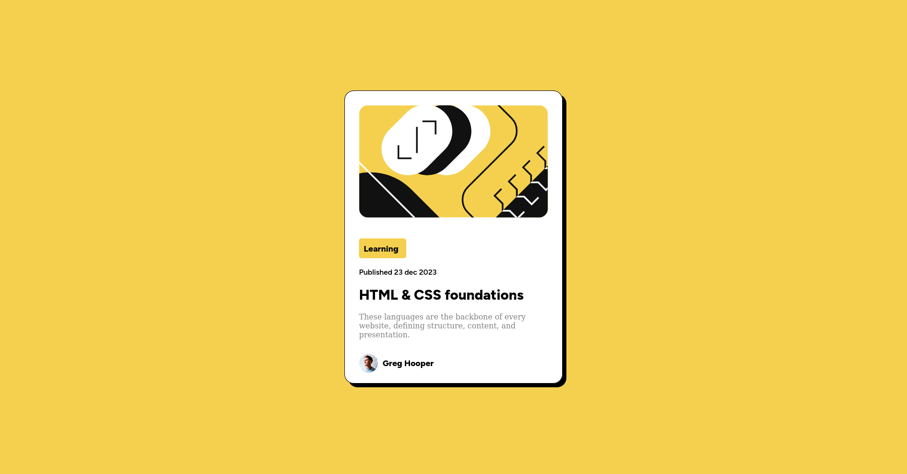

# Frontend Mentor - Blog preview card

Projeto desenvolvido do desafio frontend mentor que se tratar de um card, feito em HTML e CSS

## Demonstração

### **EXPECTATIVA**

### **REALIDADE**

**Have fun building!** 🚀
